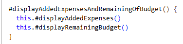
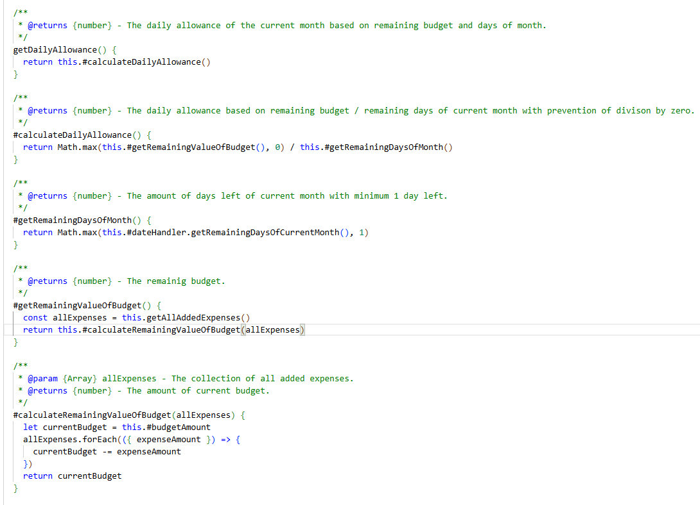
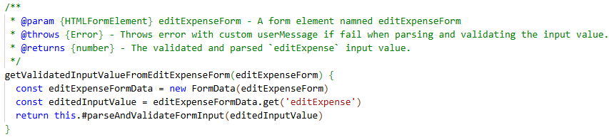
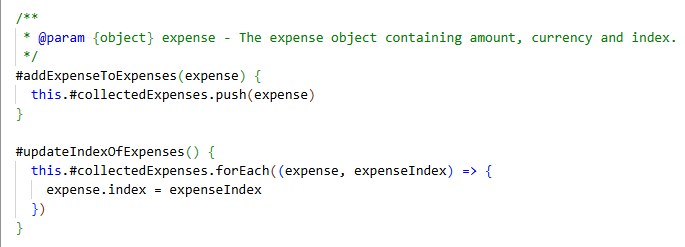
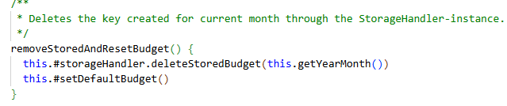
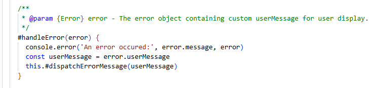
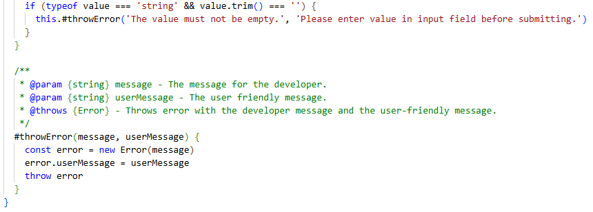
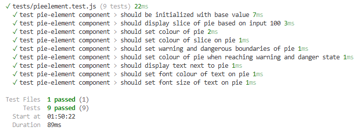
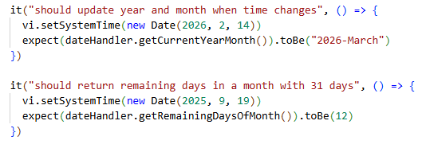
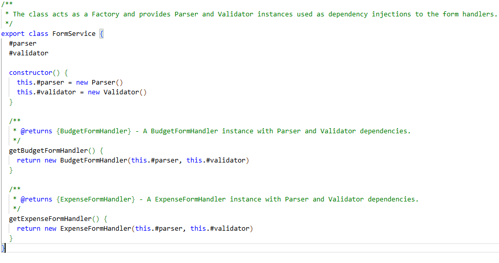

# Reflektion över Clean Code kapitel 2-11
Denna reflektion visar hur jag har arbetat utifrån ett "Clean Code" perspektiv i mitt projekt. 

Jag har insett att det är både väldigt svårt och frustrerande och kanske framför allt tidskrävande att jobba med Clean Code. Det känns som att man kan försöka ”refaktorera” koden i oändlighet och ändå inte vara nöjd. Jag tycker att jag har kommit en bit på vägen nu även om jag är medveten om att många ”fel” kvarstår och kan förbättras ur ett Clean Code perspektiv, framför allt storleken på vissa metoder och att hålla olika abstraktionsnivåer separerade från varandra. 

Jag började koda mitt projekt och kom ganska långt innan det blev tydligt att vi skulle försöka jobba på ett objektorienterat sätt. 
Det är svårt nog i Javascript och ännu svårare att enbart vara i frontend och göra det.

Mycket fokus har lagts på allt ovan och funktionalitet i applikationen har därför fått prioriterats ner och alla tänkta features från kravspecifikationen har inte implementerats ännu.

## Kapitel 2 -  Meaningful Names
Jag har försökt att namnge mina variabler och metoder på ett sådant sätt som besvarar frågorna varför de finns, vad de gör och hur de används för att följa principen **Use Intention Revealing Names** och även **Add Meaningful Context**. Liksom under arbetet med modulen har detta bidragit till väldigt långa namn. Författaren menar dock att långa, beskrivande namn är bättre än korta och otydliga och bättre än "onödiga" kommentarer. Så jag behåller mina långa namn. En annan anledningen till att de är långa är för att undvika **Mental Mapping** då jag bl.a. undviker förkortningar. För övrigt tycker jag att jag har gjort ett grundligt arbete i att vara konsekvent i namngivningen. Jag använder mig av mycket ord som har en direkt koppling till den befintliga klassen/metoden och använder t ex alltid `get` för att antyda att någon form av data kommer att hämtas.

## Kapitel 3 - Functions
Jag har försökt att följa principerna att göra metoderna **små** och dölja implementationernas detaljer bakom **beskrivande namn** för bättre läsbarhet. 
Nedan visas en större sektion från min kod i BudgetAppHandler-klassen. När jag först skrev denna kod var det i en enda stor metod. Men för att undvika **side effects** där koden gör mer än vad namnet avslöjar och även följa **The Stepdown Rule** så försökte jag bryta ut det mesta steg för steg. Koden går nu att läsa i ett flöde uppifrån och ned och följer **One Level of Abstraction per Function**. Jag ser dock att jag misslyckats med att följa **Verb/Nyckelordsregeln** här som säger att argumentens namn bör kodas in i metodnamnet om det är en monad. Det har jag missat i den sista metoden.För att undvika DRY bryter jag dessutom ut all felhantering till både egen klass som ansvarar för logiken och en metod som hanterar felmeddelanden för att undvika **DRY**.

## Kapitel 4 - Comments
Jag jobbade denna gången utan kommentarer helt till en början. När jag var så gott som färdig med applikationen gick jag tillbaka till mina olika klasser och komponenter och granskade den kod jag skrivit. Detta resulterade i kommentarer till alla publika metoder, men inte nödvändigtvis långa textkommentarer i de fall då det skulle blivit upprepning av metodens namn **redundant Comments** . Jag försökte istället att förbättra namngivningen av metoden och låta namnet på metoden samt innehållet tala för sig själv. När detta ändå inte gick och metoderna inte gick att bryta ut på ett förbättrande sätt, valde jag att lägga till en kort förklaring till koden för att bidra till förståelse. Jag lade även till kommentarer till de metoder med parametrar, returer (**Informative comments**) eller som kastar undantag. Detta för att vara tydlig med side effects. För övrigt har jag använd betydligt färre kommentarer än vad jag tidigare har gjort.

Nedan viasas en kodsnutt där vi har en publik metod. JSDoc kommentaren finns där för att berätta om parametern, vad som kommer att returneras och att ett undantag kan kastas. Men i och med att namnet är så beskrivande i sig själv valde jag att inte ta med någon upprepande, förklarande text.

## Kapitel 5 - Formatting
Många av principerna i det här kapitlet har jag redan implementerat i min kod och tidigare projekt. Till exempel att följa **Horizontal Formatting** med korrekta indenteringar och  mellanslag. Jag gillar att jobba på ett strukturerat sätt och tycker om att ha det "prydligt". Jag följer **The Newspaper Methaphor** relativt väl och försöker att berätta mycket genom mina webb komponenters och klassers namn. Jag håller olika logiska delar separerade och jag försöker hålla samman kod som hör ihop nära varandra. Jag tycker dock att det kan vara svårt ibland när man har väldigt många små metoder. Då kan det ändå bli lite spretigt. 

Under det här projektet använde jag mig av en default formatter i Visual Studio Code för Typescript och Javascript. 
Nedan visas en kodsnutt med korrekta indenteringar och sammanhållning av kod som hör ihop.

## Kapitel 6 - Objects and Data Structures
Det här var ett mycket intressant kapitel då jag tidigare inte har arbetat så mycket med objektstrukturen. I L2 reflektionen skrev jag en kommentar om att jag ansåg att det kunde bli rörigare att skicka ett helt objekt istället för flera separata argument, men det tar jag tillbaka efter att ha tillämpat det nu. Jag förstår och ser nu att det blir väldigt tydligt när man använder sig av objekt och destruktering vad det är för data som hanteras och i vilket sammanhang. Jag har under min refaktorering funder över vilka metoder som kan fungera som privata hjälpmetoder och har i och med det fått till en bra **Data Abstraction**, där den interna logiken hålls gömd i de publika metoderna. Jag försöker dessutom prata med mina "vänner" och undvika **train wrecks** med betoning på försöker.

Jag har försökt att använda mig av **Data Transfer Object** för att skicka data mellan mina komponenter och övriga lager. Men jag har fortfarande svårt för begreppet **Data/Object Anti-Symmetry** och vad det egentligen innebär i praktiken.

Nedan visas en kodsnutt som visar på inkapslingen av data abstraktioner.

## Kapitel 7 - Error Handling
Jag har brutit ut min felhantering till egna util-klasser, Parser och Validator som kontrollerar och kastar undantag vid påfunnet fel och returnerar inte null, **Exceptions instead of Returns**. I mina exceptions så kastar jag två olika typer av felmeddelanden. Ett som riktar sig till utvecklaren och ett som riktar sig till anvöndaren av applikationen, **Provide context with Exceptions**. Det jag inte har gjort än är att definiera egna Exception-klasser, jag kastar endast "vanliga" Error.

## Kapitel 8 - Boundaries
Jag har skapat min webb component pie-element som använder endast vissa metoder från min PieRender-module, vilket gör att modulens API inte exponeras och gör att min kod skyddas mot förändringar i modulen. Jag låter min komponent vara den enda som får ansvara för modulen och håller **clean boundaries**. Jag har dessutom testat modulens funktionalitet.

## Kapitel 9 - Unit Tests
Jag har implementerat automatiserade enhetstester för DateHandler.js och för min komponent pie-element.js som fungerar som en koppling till och instansierar PieRender-modulen. Mest för att lära sig mig mer kring implementation av automatiserade tester. Jag har alltså inte följt **TDD**-principen och skrivit testerna innan implementation. Däremot har jag hållit mina tester väldigt tydliga och på så sätt följt **Clean Test** principen som handlar om läsbarhet samt följt **Single Concept per Test** principen som handlar om att endast testa ett koncept per test.

## Kapitel 10 - Classes
Jag har delat upp min applikation i flera olika webb komponenter och flera klasser som ansvarar för sina egna områden. BudgetAppHandler klassen ansvarar för allt som rör budgeten, utgifter och beräkningar, medan StorageHandler i sin tur ansvarar för allt som rör lagring i localStorage. DateHandler, ExpenseFormHandler och budgetFormHandler har sina egna ansvar. Utifrån den aspekten tycker jag att jag har uppnått en god abstraktionsnivå och följer **Single Responsibility Principle**. I stället för att jobba med många instansvariabler som jag tidigare har gjort när jag skapat klasser, har jag använt mig av färre men mer använda av fler metoder för att hålla hög sammanhållning, **Cohesion**. 

## Kapitel 11 - Systems
Mycket kändes bekant i det här kapitlet. Jag hann dock börja koda en hel del innan jag läste det och kände att det var för sent att införa en backend. Med facit i hand ångrar jag att jag inte gjorde det för en ännu tydligare struktur.

Trots att mitt projekt är uppbyggt med webb komponenter så har jag försökt att implementera någon form av MVC-arkitektur och försökt att följa principen **Separation of Concerns**, vilket innebär en fördelning av systemet i olika delar med tydliga egna ansvar. 

Mina webb komponenter ansvarar för presentationslagret (view) där min budget-app komponent fungerar som en Controller som ansvarar för det övergripande flödet och uppdaterar vyn beroende på det aktuella tillståndet för budget, utgifter, återstående budget, kvar att spendera per dag osv. All affärslogik är separerad och flyttad till egna klasser under logic-mappen (model).  

Jag har försökt att jobba med **Dependency Injection** som kapitlet föreslåt för att undvika direkta beroenden och på så sätt underlätta för bl.a. testning. FormService fungerar som en mindre Factory som skapar Parser och Validator instanser som injiceras vid skapandet av BudgetFormHandler och ExpenseFormHandler och delas av dessa. BudgetAppService fungerar på samma sätt men skapar DateHandler och StorageHandler instanser som injiceras vid skapandet av BudgetAppHandler. 

Det här bidrar till en lös koppling **loose coupling** mellan klasserna.

