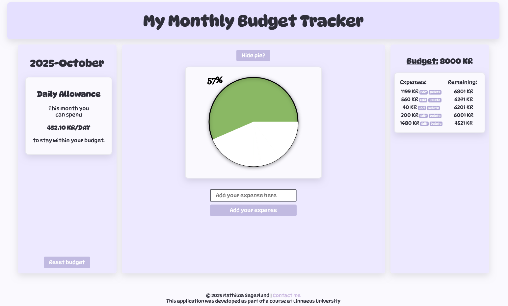

# <budget-app>
This is a custom web component that acts as the Controller of the application MyMonthlyBudgetTracker.
It connects and coordinates the other web components, listens for events from these components, manages the visibility of the views 
and connects the user interactions to the right internal business logic of the application. 

The business logic is handled by an instance of the BudgetAppHandler class, created through an instance of the BudgetAppService.

The component coordinates the state of the budget, the visualization of the budget as a pie, the daily allowance calculation and the storage of the budget. 

## Usage
```javascript
import './budget-app.js'
```

Then in your HTML

```html
<budget-app></budget-app>
```

Can be used as the root component of the application.

## Example 


## Files and Structure
budget-app.js - Main web component logic that defines the custom element.
budget-app.html.js - HTML template with structure of the component.
budget-app.css.js - CSS template for styling the component.